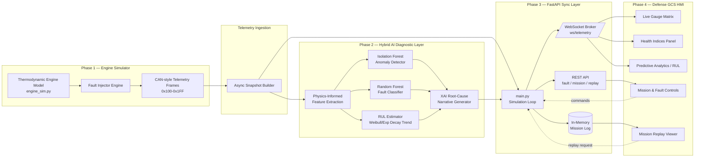

# AI-Enabled Real-Time Digital Twin — Aero Piston Engine (MALE UAV)

End-to-end prototype: physics-based engine simulator → physics-informed
AI diagnostics (anomaly detection, fault classification, RUL) → FastAPI
sync layer → React/Tailwind Ground Control Station HMI.

## Architecture



## Run locally (no Docker)

```bash
# Backend
cd backend
pip install -r requirements.txt
uvicorn main:app --host 0.0.0.0 --port 8000 --reload

# Frontend (separate terminal)
cd frontend
npm install
npm run dev   # http://localhost:5173, expects backend on localhost:8000
```

## Run with Docker (one command)

```bash
docker-compose up --build
```

- GCS Dashboard: http://localhost:8080
- Backend API/docs: http://localhost:8000/docs
- WebSocket: ws://localhost:8000/ws/telemetry

> Note: `App.jsx` defaults to `localhost:8000` for API/WS calls for local dev
> convenience. When deployed behind the bundled nginx reverse proxy (port
> 8080), switch `API_BASE`/`WS_URL` in `App.jsx` to relative paths
> (`""` and `ws://<host>/ws/telemetry`) before building, so requests route
> through the `/api/` and `/ws/` proxy locations defined in `nginx.conf`.

## Key REST endpoints

| Endpoint | Method | Purpose |
|---|---|---|
| `/api/state` | GET | One-shot current physical + digital twin state |
| `/api/fault/inject` | POST | Inject a fault (`fault_type`, `severity`, `cylinder`) |
| `/api/fault/clear` | POST | Clear all active faults |
| `/api/mission/profile` | POST | Set mission profile / altitude / throttle / ambient temp |
| `/api/mission/presets` | GET | List preset mission profiles |
| `/api/replay/start` | POST | Begin mission log replay |
| `/api/replay/stop` | POST | Stop replay, return to live telemetry |
| `/api/replay/log` | GET | Paginated raw mission log |

## Fault modes modeled

Injector Clogging · Misfire · Cooling System Degradation · Sensor Drift ·
Oil Leak · Combustion Instability — each perturbs the underlying physical
model (not just displayed values), so the AI layer is diagnosing genuine
coupled-system signatures.
